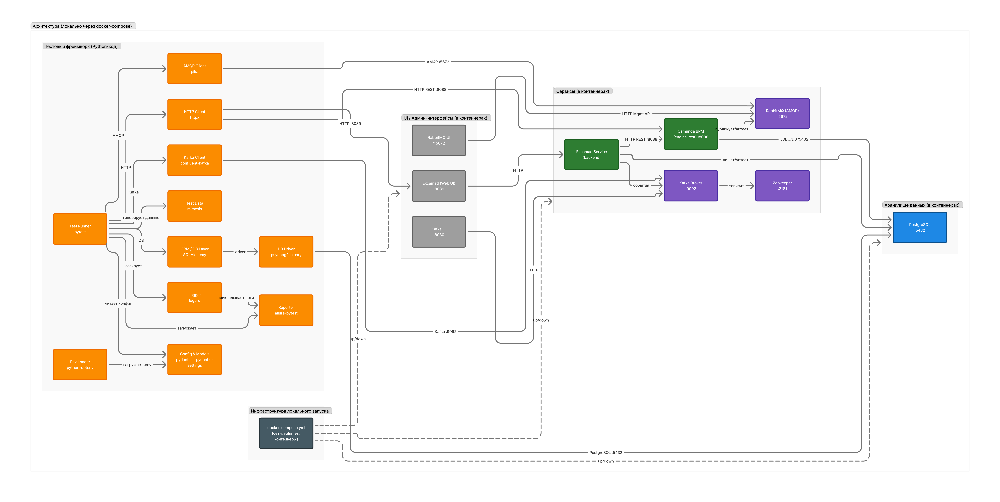

# Test Automation Framework

[](https://github.com/codegenIrlX/cdg-automation-framework/releases)
[](https://github.com/codegenIrlX/cdg-automation-framework/actions)
[](https://github.com/codegenIrlX/cdg-automation-framework/commits/main)

## Оглавление

- [1. Документация](#1-документация)
    - [1.1. Схема системы (FigJam)](#11-схема-системы-figjam)
- [2. Базовые требования Plusofon API](#2-базовые-требования-plusofon-api)
    - [2.1. Коды статусов и ошибок](#21-коды-статусов-и-ошибок)
- [3. Быстрый старт](#3-быстрый-старт)
    - [3.1 Отчеты Allure (Windows)](#31-отчеты-allure-windows)
- [4. Docker Compose](#4-docker-compose)
    - [4.1. Предусловия](#41-предусловия)
    - [4.2. Быстрый старт](#42-быстрый-старт)
    - [4.3. Развернутые сервисы](#43-развернутые-сервисы)
    - [4.4. Сервисы и порты](#44-сервисы-и-порты)
    - [4.5. Переменные окружения](#45-переменные-окружения)
    - [4.6. Healthcheck](#46-healthcheck)
    - [4.7. Инициализация PostgreSQL (seed/DDL)](#47-инициализация-postgresql-seedddl)
    - [4.8. Остановка и очистка](#48-остановка-и-очистка)
    - [4.9. Полезные команды](#49-полезные-команды)
- [5. .env переменные](#5-env-переменные)
    - [5.1. API и общие параметры](#51-api-и-общие-параметры)
    - [5.2. База данных (PostgreSQL)](#52-база-данных-postgresql)
    - [5.3. RabbitMQ](#53-rabbitmq)
    - [5.4. Kafka](#54-kafka)
    - [5.5. Camunda](#55-camunda)

## 1. Документация

### 1.1. Схема системы

Ниже — визуальная блок‑схема взаимодействия сервисов и тестового фреймворка.



| Название                          | Ссылка на документацию                                                                                                      |
|-----------------------------------|-----------------------------------------------------------------------------------------------------------------------------|
| Python-код                        | [Документация по Python-коду](https://github.com/codegenIrlX/cdg-automation-framework/tree/dev/docs/python)                 |
|                                   |                                                                                                                             |
| Архитектура                       | [Документация по архитектуре](https://github.com/codegenIrlX/cdg-automation-framework/tree/main/docs/architecrure)          |
|                                   |                                                                                                                             |
| Метрики                           | [Документация по метрикам](https://github.com/codegenIrlX/cdg-automation-framework/tree/main/docs/metrics)                  |
|                                   |                                                                                                                             |
| Фреймворк / Библиотеки            | [Документация по библиотекам](https://github.com/codegenIrlX/cdg-automation-framework/tree/dev/docs/framework/dependencies) |
| Фреймворк / Alembic (опционально) | [Документация по Alembic](https://github.com/codegenIrlX/cdg-automation-framework/tree/dev/docs/framework/alembic)          |
| Фреймворк / Allure                | [Документация по Allure](https://github.com/codegenIrlX/cdg-automation-framework/tree/dev/docs/framework/allure)            |
| Фреймворк / HTTPX                 | [Документация по HTTPX](https://github.com/codegenIrlX/cdg-automation-framework/tree/dev/docs/framework/httpx)              |
| Фреймворк / Pydantic              | [Документация по Pydantic](https://github.com/codegenIrlX/cdg-automation-framework/tree/dev/docs/framework/pydantic)        |
| Фреймворк / Pytest                | [Документация по Pytest](https://github.com/codegenIrlX/cdg-automation-framework/tree/dev/docs/framework/pytest)            |
| Фреймворк / SQLAchemy             | [Документация по SQLAchemy](https://github.com/codegenIrlX/cdg-automation-framework/tree/dev/docs/framework/SQLAlchemy)     |
|                                   |                                                                                                                             |
| Тест-кейсы                        | [Документация по тест-кейсам](https://github.com/codegenIrlX/cdg-automation-framework/tree/dev/docs/test_cases)             |

## 2. Базовые требования Plusofon API

- [Документация по работе с API](https://help.plusofon.ru/api/v1)
- Адрес: `https://restapi.plusofon.ru`
- Авторизация: тип `Bearer Token`
- Обязательный заголовок `Client`: значение `10553`

### 2.1. Коды статусов и ошибок

| Код | Описание                    |
|-----|-----------------------------|
| 200 | запрос успешно выполнен     |
| 201 | сущность успешно создана    |
| 400 | параметр указан некорректно |
| 404 | целевая сущность не найдена |
| 500 | нет доступа                 |

## 3. Быстрый старт

1. Скопировать `.env.example` в `.env` и заполнить значения.
2. Установить зависимости: `python -m pip install -e .`
3. Запустить тесты: `pytest`.
4. Если IDE подсвечивает импорты, отметить `src` как **Sources Root** и выполнить **Invalidate Caches / Restart**.

### 3.1. Отчеты Allure (Windows)

Установка Allure в Windows (через Scoop):

```bash
Set-ExecutionPolicy RemoteSigned -Scope CurrentUser
irm get.scoop.sh | iex
scoop install allure
allure --version
```

Генерация и отображение отчета Allure:

```bash
pytest --alluredir=allure-results
allure serve allure-results
```

## 4. Docker Compose

Для локального запуска инфраструктуры (PostgreSQL + RabbitMQ + Kafka + Kafka UI) используется файл `docker-compose.yml`.

### 4.1. Предусловия

- Установлен Docker Desktop / Docker Engine
- Доступна команда `docker compose` (Compose v2)

### 4.2. Быстрый старт

```bash
# поднять сервисы в фоне
docker compose up -d

# проверить статус
docker compose ps

# посмотреть логи
docker compose logs -f
```

### 4.3. Развернутые сервисы

| Сервис      | URL                    | Описание                                                      |
|-------------|------------------------|---------------------------------------------------------------|
| RabbitMQ UI | http://localhost:15672 | Web UI для просмотра очередей/сообщений и управления RabbitMQ |
| Kafka UI    | http://localhost:8080  | Web UI для просмотра кластеров/топиков/сообщений Kafka        |
| Excamad    | http://localhost:8089/#/ | Web UI (админка) для работы с процессами Camunda через REST API |
| PostgreSQL  | `127.0.0.1:5432`       | Подключение к БД (например, через psql/IDE/DB-клиент)         |

> **Интеграция с Camunda:** Excamad подключается к движку Camunda через REST API: `http://localhost:8088/engine-rest/`.

### 4.4. Сервисы и порты

- **PostgreSQL**: `127.0.0.1:5432` (image: `postgres:16-alpine`)
- **RabbitMQ**: `127.0.0.1:5672` (AMQP) и `127.0.0.1:15672` (Management UI) (image: `rabbitmq:3-management`)
- **Kafka**: `127.0.0.1:9092` (Broker) (image: зависит от compose)
- **Kafka UI**: `http://localhost:8080` (Web UI) (image: зависит от compose)
- **Excamad**: `http://localhost:8089/#/` (Web UI) (image: зависит от compose)

> Порты проброшены только на `127.0.0.1`, поэтому сервисы доступны **только локально**.

### 4.5. Переменные окружения

`docker-compose.yml` ожидает переменные из `.env` (или из окружения), например:

- `POSTGRES_DB`, `POSTGRES_USER`, `POSTGRES_PASSWORD`
- `RABBITMQ_USER`, `RABBITMQ_PASSWORD`, `RABBITMQ_VHOST`
- `CAMUNDA_BASE_URL`, `CAMUNDA_AUTH_TOKEN`

### 4.6. Healthcheck

В compose настроены healthcheck’и:

- PostgreSQL: `pg_isready`
- RabbitMQ: `rabbitmq-diagnostics check_running`

Статус можно увидеть через:

```bash
docker compose ps
```

### 4.7. Инициализация PostgreSQL (seed/DDL)

При старте контейнера PostgreSQL монтируется каталог:

- `./init/db` → `/docker-entrypoint-initdb.d` (read-only)

Положите туда `.sql`/`.sh` файлы — они выполнятся **один раз** при первом создании volume.

### 4.8. Остановка и очистка

```bash
# остановить сервисы
docker compose down

# остановить и удалить volumes (сотрёт данные БД/очереди)
docker compose down -v
```

### 4.9. Полезные команды

```bash
# пересобрать (если есть build-секции) и перезапустить
docker compose up -d --force-recreate

# перезапустить один сервис
docker compose restart postgres
docker compose restart rabbitmq

# создать Kafka-топик вручную (для тестирования)
docker compose exec kafka bash -lc "kafka-topics --bootstrap-server localhost:9092 --create --topic test.topic --partitions 1 --replication-factor 1"
```

## 5. .env переменные

Все настройки берутся из файла `.env`. Базовый шаблон расположен в `.env.example`.

### 5.1. API и общие параметры

| Переменная        | Описание                                                       | Пример                        |
|-------------------|----------------------------------------------------------------|-------------------------------|
| `ENVIRONMENT`     | Окружение.                                                     | `dev`                         |
| `BASE_URL`        | Базовый URL API, к которому выполняются запросы.               | `https://restapi.plusofon.ru` |
| `API_TOKEN`       | Bearer-токен для авторизации в API. Должен быть задан вручную. | `your_token_here`             |
| `CLIENT_ID`       | Значение заголовка `Client`, обязательное для Plusofon API.    | `10553`                       |
| `TIMEOUT_SECONDS` | Таймаут HTTP-запросов в секундах.                              | `10`                          |
| `VERIFY_SSL`      | Проверка SSL-сертификата (`true/false`).                       | `true`                        |
| `LOG_LEVEL`       | Уровень логирования приложения (`DEBUG`, `INFO`).              | `INFO`                        |

### 5.2. База данных (PostgreSQL)

| Переменная    | Описание                                            | Пример      |
|---------------|-----------------------------------------------------|-------------|
| `DB_HOST`     | Хост базы данных.                                   | `localhost` |
| `DB_PORT`     | Порт PostgreSQL.                                    | `5432`      |
| `DB_NAME`     | Имя базы данных.                                    | `sipplus`   |
| `DB_USER`     | Пользователь базы данных.                           | `sipplus`   |
| `DB_PASSWORD` | Пароль пользователя базы данных.                    | `change_me` |
| `DB_ECHO`     | Логирование SQL-запросов SQLAlchemy (`true/false`). | `false`     |

### 5.3. RabbitMQ

| Переменная          | Описание                      | Пример      |
|---------------------|-------------------------------|-------------|
| `RABBITMQ_HOST`     | Хост RabbitMQ.                | `localhost` |
| `RABBITMQ_PORT`     | Порт AMQP.                    | `5672`      |
| `RABBITMQ_USER`     | Пользователь RabbitMQ.        | `guest`     |
| `RABBITMQ_PASSWORD` | Пароль пользователя RabbitMQ. | `guest`     |
| `RABBITMQ_VHOST`    | Virtual host в RabbitMQ.      | `/`         |

### 5.4. Kafka

| Переменная   | Описание           | Пример      |
|--------------|--------------------|-------------|
| `KAFKA_HOST` | Хост Kafka брокера | `localhost` |
| `KAFKA_PORT` | Порт Kafka брокера | `9092`      |

### 5.5. Camunda

> Переменные ниже используются для интеграции Excamad с движком Camunda и (опционально) для настройки самого движка.

#### Порты (опционально)

| Переменная       | Описание                                              | Пример  |
|------------------|-------------------------------------------------------|---------|
| `CAMUNDA_PORT`   | Порт Camunda (если нужно переопределить дефолт compose). | `8088`  |
| `EXCAMAD_PORT`   | Порт Excamad (если нужно переопределить дефолт compose). | `8089`  |

#### Доступ к Camunda REST API

| Переменная            | Описание                                                                 | Пример                                 |
|----------------------|--------------------------------------------------------------------------|----------------------------------------|
| `CAMUNDA_BASE_URL`   | Базовый URL для подключения к Camunda (engine-rest).                     | `http://localhost:8088/engine-rest/`   |
| `CAMUNDA_AUTH_TOKEN` | Токен авторизации (если требуется). Передаётся в заголовках запросов.    | `your_token_here`                      |

#### JDBC для Camunda (используем PostgreSQL из compose)

> Для контейнеров внутри `docker compose` в JDBC-URL используется имя сервиса `postgres` и порт `5432`.

| Переменная              | Описание                                                     | Пример                                           |
|------------------------|--------------------------------------------------------------|--------------------------------------------------|
| `CAMUNDA_JDBC_URL`     | JDBC-строка подключения Camunda к PostgreSQL.                 | `jdbc:postgresql://postgres:5432/${DB_NAME}`     |
| `CAMUNDA_JDBC_USER`    | Пользователь БД для Camunda (можно переиспользовать `DB_USER`). | `${DB_USER}`                                     |
| `CAMUNDA_JDBC_PASSWORD`| Пароль пользователя БД для Camunda (можно переиспользовать `DB_PASSWORD`). | `${DB_PASSWORD}`                        |

#### CORS (важно для Excamad)

| Переменная                   | Описание                                                                 | Пример                                  |
|-----------------------------|--------------------------------------------------------------------------|-----------------------------------------|
| `CAMUNDA_CORS_ALLOWED_ORIGINS` | Разрешённые Origin’ы для запросов к Camunda (Excamad в браузере).        | `http://localhost:${EXCAMAD_PORT}`      |
